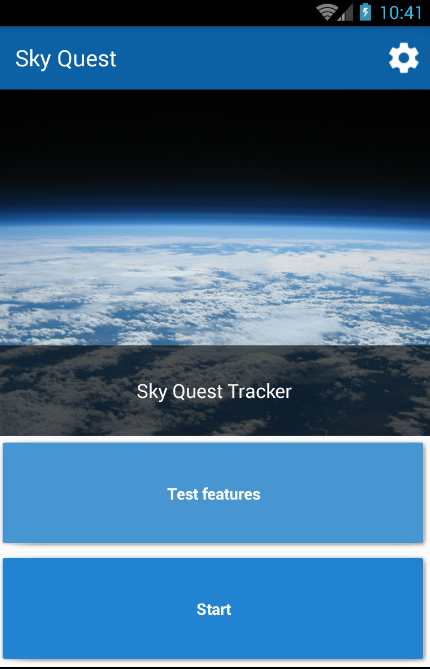
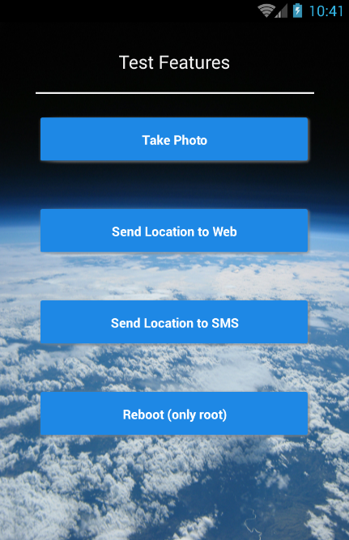

# Sky Quest
A weather balloon tracker

 
## Features include:
* Send location  via internet connection and/or SMS
* Take pictures in a adjustable interval
* If devices restarts, the application run again automatically
* Features test module

## Coming soon:
* Activity monitor in main screen
* Movement detection that triggers recovery actions (Saves battery and send current location)
* Emits sound if receive certain notification (crafted SMS or Push Notification)
* Monitor module that shows current location of launched device

## Screenshots

Main screen

Test features screen

Contributions are most welcomed.